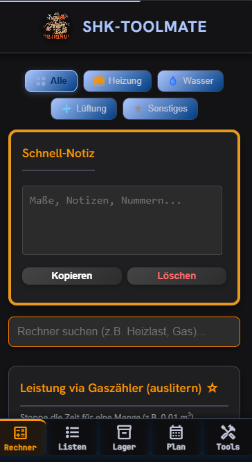

# SHK-ToolMate

[](https://github.com/NouBou1/SHK_Mate/actions/workflows/ci.yml)
[](LICENSE)

Eine Werkzeugkiste für den SHK-Alltag — 20 Fachrechner, Projektverwaltung und
Dokumentation in einer App. **Vanilla HTML, CSS und JavaScript**, ohne Framework
und ohne Build-Schritt. Läuft als installierbare PWA im Browser und über
[Capacitor](https://capacitorjs.com) als native Android-App.

**Live-Demo:** https://shk-mate.n-boussaada.de

<p align="center">
  
</p>

<p align="center"><em>Rechner-Ansicht auf dem Smartphone — Kategoriefilter, Schnell-Notiz,
Suche und die als Favorit markierten Rechner zuoberst.</em></p>

---

## Inhaltsverzeichnis

- [Features](#features)
- [Technologien](#technologien)
- [Lokal starten](#lokal-starten)
- [Android-Build](#android-build)
- [Projektstruktur](#projektstruktur)
- [Architektur](#architektur)
- [Code-Konventionen](#code-konventionen)
- [Was ich dabei gelernt habe](#was-ich-dabei-gelernt-habe)
- [Ideen für Erweiterungen](#ideen-für-erweiterungen)
- [Lizenz](#lizenz)

---

## Features

Fünf Bereiche über die untere Navigationsleiste:

**Rechner** — 20 Fachrechner, nach Gewerk gefiltert und durchsuchbar

| Bereich | Rechner |
|---|---|
| Heizung | Heizlast, Heizkörperleistung, Leistung-Check aus Vor-/Rücklauf, Kondensatmenge, Feuerungsleistung am Gaszähler |
| Hydraulik | Volumenstrom, Kv-Wert mit Ventil-Voreinstellung |
| Behälter | MAG-Vordruck, Füllstand liegender Tank |
| Trinkwasser | Wasserhärte, Mischwasser-Ertrag, Aufheizzeit, Zirkulationspflicht |
| Rohrnetz | Rohrinhalt, Strömungsgeschwindigkeit |
| Lüftung | Luftwechsel und Mindestvolumenstrom |
| Montage | Versatzbogen 45°, Abwassergefälle, Kernbohrung, Schellenabstand |

- **Favoriten** — Rechner per Stern nach oben sortieren, Startansicht der Liste
- **Grenzwert-Hinweise** — kritische Ergebnisse werden farblich hervorgehoben,
  etwa die 3-Liter-Regel nach DVGW W 551 oder zu hohe Strömungsgeschwindigkeit
- **Ergebnis teilen** — über die native Share-Funktion oder in die Zwischenablage

**Material** — Baustellen anlegen, Materiallisten führen, Positionen fotografieren,
Rapport als PDF mit Unterschrift exportieren

**Tools** — Einheiten-Wandler, Fehlercode-Suche, digitale Wasserwaage über die
Lagesensoren des Geräts

**Inventar** — Fahrzeugbestand mit Plus/Minus-Zählern und Warnung bei niedrigem Bestand

**Kalender** — Monatsansicht mit Markierung der Tage, an denen Baustellen anstehen

Dazu durchgehend: **offlinefähig** über einen Service Worker, **Schnell-Notiz** mit
Auto-Speicherung, alle Daten bleiben **lokal auf dem Gerät**.

---

## Technologien

| Technologie | Einsatz |
|---|---|
| HTML5 | semantisches Markup, ARIA-Labels, Skip-Link |
| CSS3 | Flexbox, Grid, Custom Properties, modular je Bereich |
| JavaScript (ES2022) | ES-Module, kein Bundler, kein Build-Schritt |
| Service Worker | Offline-Cache, App-Shell-Strategie |
| LocalStorage | Projekte, Favoriten, Notizen, Inventar, Checkliste |
| Capacitor 8 | Android-Build, Filesystem, Share, StatusBar |
| jsPDF | PDF-Rapport, erst nach Zustimmung nachgeladen |
| ESLint + node:test | Lint und 94 Tests, beides ohne weitere Abhängigkeiten |

Zur Laufzeit im Browser wird nichts nachgeladen — die Schriften liegen lokal,
und jsPDF kommt erst dann von einem CDN, wenn der PDF-Export ausdrücklich
genutzt und die Übertragung der IP-Adresse bestätigt wurde.

---

## Lokal starten

```bash
git clone https://github.com/NouBou1/SHK_Mate.git
cd SHK_Mate
```

Die App braucht einen HTTP-Server, weil ein Service Worker über `file://` nicht
registriert werden kann:

```bash
# Variante A: Node.js
npx http-server -p 8000

# Variante B: Python
python -m http.server 8000
```

**Variante C:** In VS Code die Erweiterung *Live Server* installieren und „Go Live" klicken.

Anschließend `http://localhost:8000` öffnen.

> **Hinweis:** Auf `http://localhost` deaktiviert sich der Service Worker selbst und
> räumt bereits registrierte Worker samt Cache ab. Grund: Ein Service Worker gilt
> pro Origin, also pro Host **und Port** — ein anderes Projekt auf demselben Port
> bekäme sonst Dateien aus dem SHK-Cache ausgeliefert. Die native App ist davon
> ausgenommen.

Für Abhängigkeiten und Lint:

```bash
npm install
npm run lint    # ESLint über App und Tests
npm test        # 94 Tests über alle 20 Rechner
```

---

## Android-Build

```bash
npm install
npx cap sync android    # Web-Assets nach android/ kopieren
npx cap open android    # in Android Studio öffnen
```

Details in der [Installationsanleitung](INSTALLATION.md), der
[Testanleitung](docs/ANDROID_TEST_ANLEITUNG.md) und dem
[Play-Store-Leitfaden](docs/PLAYSTORE_DEPLOYMENT.md). Zum Umgang mit den
Keystores siehe [SECURITY.md](SECURITY.md) — sie gehören **nicht** ins Repository.

---

## Projektstruktur

```
SHK_Mate/
├── index.html                  # Markup; ein einziges <script type="module">
├── app.js                      # Einstieg: Aktionen anmelden, Module starten
├── sw.js                       # Service Worker, Offline-Cache
├── manifest.json               # PWA-Manifest
├── capacitor.config.json       # Android-Konfiguration
├── css/                        # Reihenfolge = Kaskade
│   ├── base.css                # Schriften, Farbvariablen, Reset, Karten
│   ├── forms.css               # Eingabefelder, Buttons, Ergebnisbox
│   ├── navigation.css          # Untere Navigationsleiste
│   ├── projects.css            # Projekt-/Materiallisten, Notizblock
│   ├── tables.css              # Technische Tabellen, Elektro-Zonen
│   ├── calendar.css            # Monatskalender
│   ├── media.css               # Wetterkarte, Bilder, Vollbild-Modal
│   └── inventory.css           # Fahrzeug-Lager, Rechner-Kategorien
├── js/
│   ├── core/
│   │   ├── constants.js        # Normwerte, Grenzwerte, Storage-Keys
│   │   ├── utils.js            # Ergebnisausgabe, Teilen, Kopieren
│   │   ├── navigation.js       # Tabs, Kategorien, Kartenfilter
│   │   ├── actions.js          # Event-Delegation statt onclick
│   │   ├── external-scripts.js # Nachladen externer Bibliotheken
│   │   └── android-init.js     # Status-/Navigationsleiste, Tastatur
│   ├── calc/
│   │   ├── common.js           # runCalculator() – Ablauf aller Rechner
│   │   ├── heizung.js          # Heizlast, HK, Leistung, Kondensat, Gas
│   │   ├── hydraulik.js        # Volumenstrom, Kv-Wert
│   │   ├── behaelter.js        # MAG, liegender Tank
│   │   ├── wasser.js           # Härte, Mischwasser, Aufheizzeit, Zirkulation
│   │   ├── rohrnetz.js         # Rohrinhalt, Fließgeschwindigkeit
│   │   ├── lueftung.js         # Luftwechsel
│   │   └── montage.js          # Versatzbogen, Gefälle, Kernbohrung, Schellen
│   ├── modules/                # Projekte, Material, Fotos, PDF, Kalender, …
│   │   └── project-state.js    # einzige Quelle für Projekte + aktuelles Projekt
│   └── tools/converters.js     # Einheiten-Wandler
├── tests/                      # node:test, 94 Tests über alle Rechner
├── .github/workflows/ci.yml    # Lint + Tests bei jedem Push
├── assets/                     # Icons, Schriften, Logo
├── android/                    # Android-Projekt (Gradle)
└── docs/                       # Projektdokumentation
```

---

## Architektur

`index.html` bindet genau **ein** Script ein: `app.js` als ES-Modul. Alles
Weitere kommt über Importe herein, die Ladereihenfolge ergibt sich aus dem
Importgraphen. Kein Bundler, kein Build-Schritt — der Browser löst die
32 Module selbst auf.

Das Markup enthält **kein** `onclick`. Verhalten hängt an `data-action`;
ein Listener je Ereignistyp am `document` verteilt an die in `app.js`
angemeldeten Aktionen — auch an Elemente, die erst später entstehen.

### Der Rechner-Ablauf

Alle 20 Rechner teilen sich **eine** Ablaufsteuerung in `js/calc/common.js`.
Ein Rechner ist keine Funktion mit Programmablauf, sondern eine Definition aus
vier benannten Schritten:

```
runCalculator({ readInputs, validate, calculate, format })
       │
       ├─► readInputs   DOM      ──► Eingabewerte
       ├─► validate     Eingaben ──► { valid, error }      ─┐ bei Fehler:
       ├─► calculate    Eingaben ──► Ergebnisobjekt         │ Abbruch mit
       └─► format       Ergebnis ──► Anzeigetext           ─┘ Meldung im Feld
```

```javascript
function calcHeizlast() {
    runCalculator({
        name: 'calcHeizlast',
        resultId: 'res_heizlast',
        readInputs: readHeizlastInputs,
        validate: validateHeizlastInputs,
        calculate: calculateHeatLoad,
        format: formatHeizlastResult
    });
}
```

Optional kommen `warn` (Ergebnisfeld rot einfärben) und `update` (zusätzliche
DOM-Ausgabe, etwa die Ventilstufe beim hydraulischen Abgleich) dazu.

Der Nutzen: Die Fehlerbehandlung und der Ablauf stehen genau einmal im Projekt
statt in jedem Rechner. `calculate` und `format` sind reine Funktionen ohne
DOM-Zugriff und damit einzeln prüfbar — die Umstellung auf diese Struktur wurde
mit 78 Testfällen gegen die alte Implementierung abgesichert.

### Trennung der Zuständigkeiten

- **`js/core/constants.js`** ist die einzige Quelle für Normwerte, Grenzwerte
  und LocalStorage-Keys. Keine Datei hält eigene Kopien.
- **`js/core/utils.js`** ist die einzige Stelle, die Ergebnisse ins DOM schreibt.
- **PDF-Export** ist in vier Schritte getrennt: Unterschrift erfassen
  (`signature.js`), Dokument aufbauen (`pdf-document.js`), speichern
  (`pdf-storage.js`), Ablauf steuern (`pdf-export.js`).
- **Projekte** trennen Datenhaltung (`projects-storage.js`), Projektverwaltung
  (`projects.js`) und Materialliste (`materials.js`).

---

## Code-Konventionen

Vier Regeln, die für jede Änderung gelten:

1. **Max. 14 Zeilen pro Funktion**, inklusive Signatur und schließender Klammer
2. **Eine Aufgabe pro Funktion** — Lesen, Prüfen, Rechnen und Formatieren sind
   jeweils eigene Funktionen
3. **Max. 400 Zeilen pro Datei**
4. **Sprechende Namen** — kein `vol`, `dt` oder `p0`

Dazu: kein `onclick` im Markup, kein `innerHTML` mit Nutzerdaten, kein Zugriff
über `window.` zwischen Modulen.

Stand heute: 500 Funktionen, keine über 14 Zeilen, größte Datei 263 Zeilen,
keine Zyklen im Importgraphen. Geprüft durch `npm run lint` und 94 Tests,
beides bei jedem Push über GitHub Actions.

---

## Was ich dabei gelernt habe

- **Konstanten dürfen nicht von der Realität abweichen.** In `constants.js`
  standen LocalStorage-Keys, die niemand benutzte und die nicht zu den echten
  Keys im Code passten (`shk_favorites` statt `shk_favs`). Hätte jemand sie
  eingesetzt, wären Favoriten und Notizen aller Bestandsnutzer verschwunden.
  Ungenutzte Konstanten sind kein harmloser Ballast, sondern eine gestellte Falle.
- **Ein Service Worker gilt pro Origin, nicht pro Projekt.** Host *und* Port
  entscheiden. Auf `localhost:5500` liefert er sonst fröhlich Dateien aus dem
  Cache eines völlig anderen Projekts aus.
- **Cache-Buster wirken nur vollständig.** Die `?v=`-Nummer muss in `index.html`
  *und* in der `ASSETS`-Liste des Service Workers hochgezählt werden, sonst
  bekommen Bestandsnutzer weiterhin die alte Datei — der Fehler sieht dann so
  aus, als sei der Code kaputt.
- **`/icons/` ist auf Apache ein voreingestellter Alias.** Ein eigener Ordner
  unter diesem Pfad ist auf dem Hosting nicht erreichbar. Die Icons liegen
  deshalb unter `assets/icons/`.
- **Toter Code fällt beim Aufräumen auf, nicht beim Schreiben.** Eine
  Validierungs-Bibliothek von 317 Zeilen wurde von keiner einzigen Zeile
  aufgerufen — die Rechner hatten ihre eigene Prüfung mitgebracht.
- **Ein gemeinsamer Namensraum verschluckt Fehler.** Zwei Dateien hatten je eine
  Funktion `copyToClipboard` — mit unterschiedlicher Signatur. Die später geladene
  überschrieb die andere stillschweigend, seitdem zeigte der Teilen-Button unter
  einem Rechenergebnis die Meldung des Notizblocks. Kein Werkzeug hat das
  angezeigt; mit ES-Modulen kann es nicht mehr passieren.
- **Eine Funktion pro Aufgabe zahlt sich erst beim zweiten Mal aus.** Die
  Aufteilung in `readInputs`/`validate`/`calculate`/`format` wirkte anfangs nach
  Mehrarbeit. Sie hat dann ermöglicht, den kompletten Ablauf aus 20 Rechnern
  herauszuziehen, ohne eine einzige Formel anzufassen.

---

## Ideen für Erweiterungen

- [ ] Rechenverlauf mit den letzten Ergebnissen je Rechner
- [ ] Eigene Werte für Brennwert und Rohrinnendurchmesser hinterlegen
- [ ] Projekte als Datei exportieren und importieren (Gerätewechsel)
- [ ] Materialliste direkt aus Rechenergebnissen befüllen
- [ ] iOS-Build über Capacitor

---

## Lizenz

Der Code steht unter der [MIT-Lizenz](LICENSE).

Die Rechner bilden Faustformeln und Überschlagswerte nach gängigen Regelwerken
ab (DIN EN 12831, VDI 4708, VDI 2035, DVGW W 551, DIN 1946-6, DIN 18017). Sie
ersetzen **keine** normgerechte Auslegung und keine Fachplanung. Die Ergebnisse
sind ohne Gewähr.

---

## Autor

**Noureddin Boussaada** — [@NouBou1](https://github.com/NouBou1)
